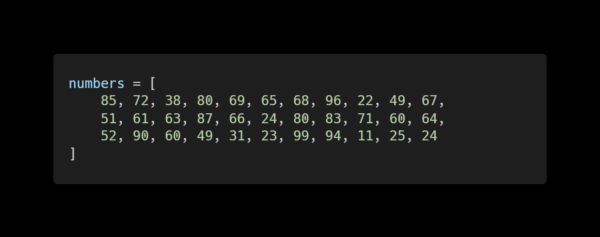

# 0118 오전 실습

#### 0117 HWS 풀이

1. 파이썬 예약어

   ```python
   import keyword
   print(keyword.kwlist)
   ```

   하면 다 나옴

2. 부동소수점 방식을 이용한 실수 연산, 비교

   ```python
   import math
   math.isclose(num1, num2)
   ```

3. 이스케이프 시퀀스

   ```python
   \n : 줄바꿈
   \t : 탭
   \\ : 백슬래시
   ```

4. String Interpolation

   '안녕, 철수야'

   ```python
   name = '철수'
   print('안녕, {}야'.format(name))
   # print('안녕, {}야, {}야'.format(name, name2))
   print(f'안녕, {name}야')
   # print(f'안녕, {name}야, {name2}야')
   ```

5. 형 변환

   ```python
   str(1)
   int('30')
   int(5)
   bool('50')
   int('3.5')
   ```

   ```python
   int('3.5')
   ```

   에러발생함

6. 네모 출력

   ```python
   print((('*'*n) + '\n')*m)
   ```

7. 이스케이프 시퀀스 응용

   ```python
   print('"파일은 c:\\Windows\\Users\\내문서\\Python에 저장이 되었습니다." \n 나는 생각했다. \'cd를 써서 git bash로 들어가 봐야지.\'')
   ```

8. 근의 공식

   ```python
   (-b + (b**2 - 4*a*c)**(1/2)) /(2*a)
   (-b - (b**2 - 4*a*c)**(1/2)) /(2*a)
   ```

   ```python
   # 1을 값으로 갖는 튜플 a를 생성하시오.
   a = (1,)
   # (1)만 보면 튜플인지 (1)인지 모름 그래서 튜플로 쓸거면 콤마 찍어야 함
   b = [1]
   c = {1}
   ```

   W 1.

   ```python
   number = int(input())
   # input만 받으면 str으로 저장됨. int로 형 변환 해줘야 함
   # 그래야 range 함수에 사용 할 수 있다.
   for i in range(1, number+1)
   	print(i)
   ```

   W 2.

   ```python
   number = int(input())
   for i in range(number, -1, -1)
   # range(start, [end, stop])
   ```

   W 3.

   ```python
   # 단, ~~~하면 ~~~하다 등의 조건 항상 만족시켜야 함
   # 값 입력받기
   number = int(input())
   
   # 출력 할 최종 값
   result = 0
   for i in range(1, number+1):
       # result = result + i
       result += i
       
   print(result)
   
   # print(sum(range(1, number+1)))
   # 당분간은 built in function 금지
   # 왜 why? IM 알고리즘 시험 대비
   ```


# 0118 오후 필기

### 0118 HW 풀이

1. #### mutable & immutable

   - immutable : string, tuple, range
   - mutable : list, set, dictionary

2. #### 홀수만 담기 (range와 slicing 활용하여 1부터 50까지의 숫자 중 홀수로만 이루어진 리스트 만들기)

   ```python
   a = list(range(1,51))
   # b = a[0: -1: 2]
   # -1 넣으면 끝까지 됨
   b = a[::2]
   # 처음부터 끝까지 2씩 건너뛰어서
   ```

3. #### Dictionary 만들기

   ```python
   class_member = {'서상균': 29 , '김구현': 19 }
   ```

4. 반복문으로 네모 출력

   ```python
   n = 5
   m = 9
   
   for height in range(m):
       print('*' * n)
       
   for height in range(m):
       for width in range(n):
           # 프린트 함수가 가진 줄 바꿈을 실행되지 않도록 설정
           print('*', end='')
       print()
   
   ```

5. #### 조건 표현식

   ```python
   #참일때 출력 {조건문} 거짓일때 출력
   temp = 36.5
   print('입실 불가') if temp >= 37.5 else print('입실 가능')
   ```

6. #### 평균 구하기

   ```python
   scores = [80, 89, 99, 83]
   ```

   ```python
   # 전체 값을 다 더해줄 변수
   total = 0
   # list scores의 길이
   # len(scores)
   # 전체 길이를 구할 변수
   length = 0
   # while은 언제 멈출 지(종료조건) 알아야 하기 때문에 for 쓸 거임
   for score in scores:
       total += score
       length += 1
   print(total / length)
   ```

   ```python
   print(sum(scores) / len(scores))
   ```

#### 	W 1. 간단한 N의 약수 (SWEA #1933) 입력으로 1개의 정수 N이 주어진다. 정수 N의 약수를 오름차순으로 출력하는 프로그램을 작성하시오.

[제약 사항]
N은 1이상 1,000이하의 정수이다. (1 ≤ N ≤ 1,000)
[입력]
입력으로 정수 N이 주어진다.
[출력]
정수 N의 모든 약수를 오름차순으로 출력한다.
[입력 예시]
10
[출력 예시]
1 2 5 10

```python
N = int(input('1이상 1000이하의 정수를 입력하세요 : '))
count = 0

if N < 1 or N > 1000:
    print('말 좀 들으세요')
else:
    for i in range(1, N+1):
    # N 나누기 i의 나머지가 0이라면
        if N % i == 0:
            print(i, end=' ')
```


#### 	W 2.중간값 찾기 (SWEA #2063 변형) 중간값은 통계 집단의 수치를 크기 순으로 배열 했을 때 전체의 중앙에 위치하는 수치를 뜻한다. 리스트 numbers에 입력된 숫자에서 중간값을 출력하라.

[출력 예시]
64



```python
# 알고리즘으로 풀면 이렇게
for i in ragne(len(numbers))
	for j in range(i + 1, len(numbers))
    
# sorted 쓰면 이렇게
sorted_numbers = sorted(numbers)
# len 2로 나눈 몫 == index 가 중간값
length = 0
for i in numbers:
    length += 1

center = length // 2
# center = len(sorted_numbers) // 2
print(sorted_numbers[center])
```


#### 	W 3.계단 만들기 자연수 number를 입력 받아, 아래와 같이 높이가 number인 내려가는 계단을 출력하시오.

[입력 예시]
4
[출력 예시]
1
1 2
1 2 3
1 2 3 4

```python
N = int(input())
N = 4

for i in range(1, N+1):
    for j in range(1, i+1):
        print(j, end=' ')
    print()
```

