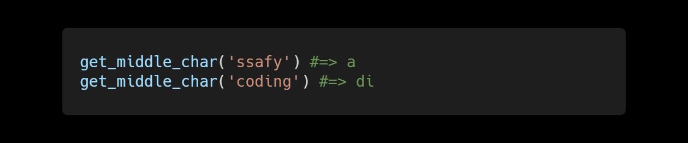
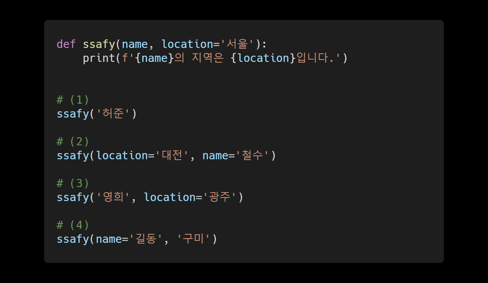
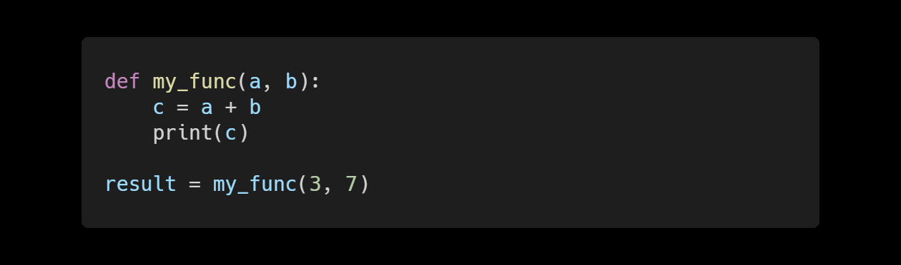
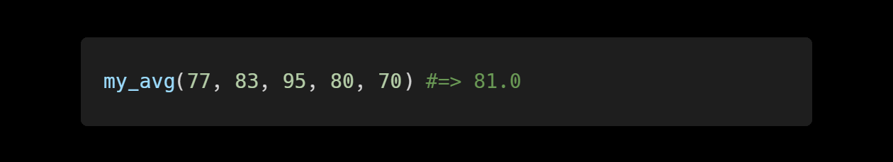
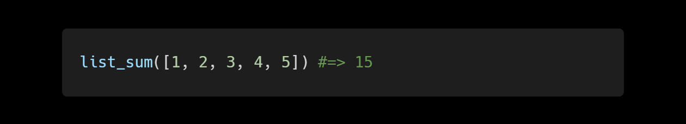
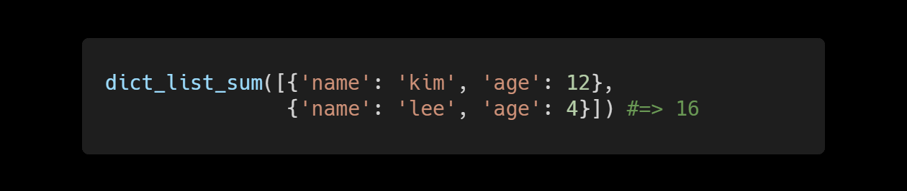
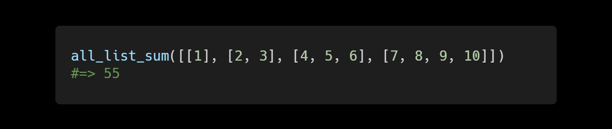

## HomeWorkShop Solution

1. ### Built-in 함수 Python에서 기본으로 사용할 수 있는 built-in 함수를 최소 5가지 이상 작성하시오.


2. ### 정중앙 문자 

   문자열을 전달 받아 해당 문자열의 정중앙 문자를 반환하는 get_middle_char 함수를 작성하시오. 단, 문자열의 길이가 짝수일 경우에는 정중앙 문자 2개를 반환한다.



```python
def get_middle_char(word):
    length = 0
    # 단어 전부 순회
    for i in word:
        # 한개씩 개수를 세어보자.
        length += 1
    # 정 중앙값
    center = length // 2

    # 만약 홀수라면
    if length % 2:
        result = word[center]
    # 만약 짝수라면
    else:
        # result = word[center-1] + word[center]
        result = word[center-1:center+1]
        ## 슬라이싱 0 1 // 2 3 // 4 5
        ## 이렇게 되어야 하니까 2부터 4까지로 범위 정해야 함
    return result

print(get_middle_char('ssafy')) # => a
print(get_middle_char('coding')) # => di
```


3. ### 위치 인자와 키워드 인자

   다음과 같이 함수가 선언되어 있을 때, 보기 (1)~(4) 중에서 실행 시 오류가 발생하는 코드를 고르시오.




4. ## 나의 반환값은

  다음과 같이 함수를 선언하고 호출하였을 때, 변수 result에 저장된 값을 작성하시오.




5. ## 가변 인자 리스트

   가변 인자 리스트를 사용하여 , 갯수가 정해지지 않은 여러 정수들을 전달 받아 해당 정수들의 평균 값을 반환하는 my_avg 함수를 작성하시오.



```python
def my_avg(*numbers):
    # 평균값을 구하기
    length = 0
    count = 0
    for i in numbers: # (77, 83, ...)
        length += 1
        count += i
    return count // length

print(my_avg(77, 83, 95, 80, 70)) # => 81.0
```


## WS1. List 의 합 구하기

  정수로만 이루어진 list 를 전달 받아 해당 list 의 모든 요소들의 합을 반환하는 list_sum 함수를 built in 함수인 sum() 함수를 사용하지 않고 작성하시오.

  

```python
# 함수 정의
# 인자는 리스트 하나

def list_sum(numbers):
    result = 0
    for number in numbers:
        result += number
    return result

print(list_sum([1, 2, 3, 4, 5])) # => 15
```


## WS2. Dictionary로 이루어진 List의 합 구하기

Dictionary로 이루어진 list를 전달 받아 모든 dictionary의 'age' key에 해당하는 value 들의 합을 반환하는 dict_list_sum 함수를 built-in 함수인 sum() 함수를 사용하지 않고 작성하시오.



```python
def dict_list_sum(infos):
    # 모든 age들을 더할 변수
    result = 0
    # 순회
    for info in infos:
        result += info['age']
        
    return result

print(dict_list = [{'name': 'harry', 'age': 5}, {'name': 'sang', 'age': 29}]) # => 34

## 키값 찾기 
## 해리의 age 찾고싶을 때
## dict_list_sum[0]['age']
## sang의 name 찾고싶을 때
## dict_list_sum[1]['name']
```


## WS3. 2차원 List의 전체 합 구하기

  정수로만 이루어진 2차원 list를 전달 받아 해당 list의 모든 요소들의 합을 반환하는 all_list_sum 함수를 built-in 함수인 sum() 함수를 사용하지 않고 작성하시오.

  

```python
def all_list_sum(numbers):
    result = 0
    for number in numbers:
        for num in number:
            result += num
    return result

print(all_list_sum([[1], [2, 3], [4, 5, 6], [7, 8, 9, 10]]))

print(sum([[1], [2, 3], [4, 5, 6], [7, 8, 9, 10]], []))

print(sum(*[[1], [2, 3], [4, 5, 6], [7, 8, 9, 10]]))
## 언패킹해도 안됨
## TypeError: sum() takes at most 2 arguments (4 given)
## 두개만 받을건데 왜 네개나 주냐고 짜증냄

```

